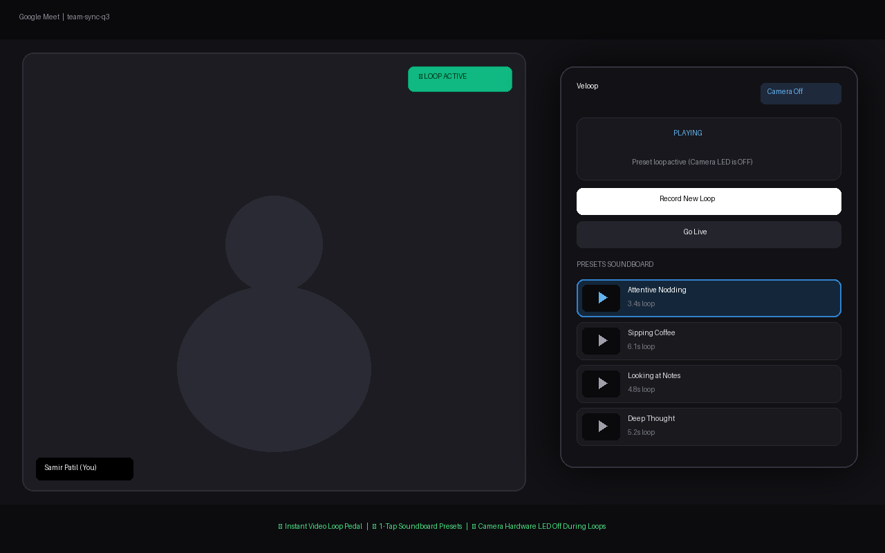

<p align="center">
  
</p>

<h1 align="center">Veloop</h1>

<p align="center">
  <strong>Instant video soundboard & loop pedal for Google Meet, Zoom, and WebRTC calls</strong>
</p>

<p align="center">
  <a href="https://chromewebstore.google.com/detail/veloop/apbjpdbilidhpdpfhdhljcnmcjoddpdc"></a>
  <a href="https://www.youtube.com/watch?v=ej5xNg_rFyc"></a>
  
  
  
</p>

---

### ✨ Why Veloop?

- **Pedal-First Video Looping** — Step on your pedal or hold a hotkey to record yourself nodding or listening, then release to loop immediately.
- **Instant Soundboard Presets** — Save in-meeting loops with custom titles (e.g., *"Attentive Nodding"*, *"Sipping Coffee"*, *"Taking Notes"*) and trigger them on demand with a single click.
- **Hardware Camera Power Management** — When looping or playing a preset, physical webcam tracks are detached and released (`releaseHardwareCamera()`), turning your webcam's green indicator LED **OFF**.
- **Seamless Seam Dissolves** — Crossfade transitions ensure loops and returning-to-live blend smoothly without harsh visual cuts or freezing frames.
- **100% Private & Local** — No external servers, no cloud uploads, zero telemetry. All video encoding (`MediaRecorder` WebM) and storage run entirely inside local browser `IndexedDB`.
- **Zero Virtual Camera Drivers** — Operates natively inside Chrome via browser `canvas.captureStream()` and `getUserMedia` interception without needing OBS or system-level kernel extensions.

---

### 📺 Demo Video

https://github.com/user-attachments/assets/e7c2297b-3fb2-44b7-981f-556eb217ce9d

<p align="center">
  <em>▶️ <a href="https://www.youtube.com/watch?v=ej5xNg_rFyc">Also on YouTube</a> — Looping webcam feed during a live video call</em>
</p>

---

#### Screenshot

<p align="center">
  
</p>

---

### 📥 Installation

#### Chrome Web Store (Recommended)

Install Veloop with one click from the official Chrome Web Store:

<p align="center">
  <a href="https://chromewebstore.google.com/detail/veloop/apbjpdbilidhpdpfhdhljcnmcjoddpdc">
    
  </a>
</p>

👉 **[Get Veloop on the Chrome Web Store](https://chromewebstore.google.com/detail/veloop/apbjpdbilidhpdpfhdhljcnmcjoddpdc)**

---

#### Developer Mode (Local Install)

1. Clone or download this repository:
   ```bash
   git clone https://github.com/samirpatil2000/veloop.git
   cd veloop
   ```
2. Install dependencies and build:
   ```bash
   npm install
   npm run build
   ```
3. Open Chrome and navigate to `chrome://extensions`
4. Toggle **Developer mode** on (top-right corner)
5. Click **Load unpacked** and select the `dist/` directory inside this repository

---

## 🚀 How it Works

Veloop turns your browser into a digital video loop pedal. It intercepts `navigator.mediaDevices.getUserMedia` at the page level and routes your webcam through an ultra-low-latency 2D canvas compositor:

1. **Synthetic Video Stream**: The meeting site receives a synthetic `MediaStream` originating from the compositor canvas.
2. **Pedal Capture & Instant Loop**: Holding <kbd>Right Option / Alt</kbd> captures uncompressed frames into memory while concurrently recording a compressed WebM stream via hardware-accelerated `MediaRecorder`.
3. **Webcam LED Extinction**: The moment you enter loop mode, the raw camera hardware tracks are terminated. Your laptop or external webcam indicator light clicks off.
4. **Preset Soundboard**: In the popup, name any active loop to store it permanently in `IndexedDB`. Whenever you are in a call, 1-tap any card on your soundboard to replay that clip seamlessly.
5. **Seamless Dissolve to Live**: Hitting <kbd>Right Command</kbd> or <kbd>L</kbd> re-acquires the physical camera in the background and executes an alpha-blended crossfade back to reality.

---

## ⌨️ Hardware & Keyboard Controls

| Shortcut / Pedal | Action | Description |
|---|---|---|
| <kbd>Right Option / Alt</kbd> (Hold & Release) | **Pedal Down / Up** | Hold to record frames, release to immediately start looping |
| <kbd>Right Command</kbd> or <kbd>L</kbd> | **Go Live** | Seamlessly dissolves from loop or preset back to live camera feed |
| <kbd>R</kbd> | **Toggle Record** | Toggle start/stop recording without holding |
| <kbd>1</kbd> – <kbd>9</kbd> (Popup) | **Trigger Preset** | Play a saved soundboard preset card |

> *Physical foot pedals sending standard keyboard keystrokes (like Right Alt or USB pedal switch) work out-of-the-box.*

---

## 🖥️ UI & Controls

- **Popup Soundboard** — Accessible via extension icon or keyboard. Features active recording state badges (`LIVE`, `REC`, `LOOP`, `PLAY`), 1-tap preset triggers, and one-click preset labeling.
- **Studio Options Control Center** — Customize maximum recording length, minimum tap threshold (to prevent accidental triggers), crossfade dissolve duration, and preview opacity.

---

## 📁 Project Structure

```
veloop/
├── manifest.json              # Chrome Manifest V3 configuration & permissions
├── package.json               # Project dependencies & build scripts
├── extension/
│   ├── icons/                 # Official extension branding (16, 32, 48, 128px PNG)
│   └── src/
│       ├── background/
│       │   └── service-worker.ts  # Extension lifecycle & tab message routing
│       ├── content/
│       │   └── bridge.ts          # Isolated world <-> Main world communication relay
│       ├── page/
│       │   └── page-bridge.ts     # WebRTC getUserMedia interceptor & canvas compositor
│       ├── core/
│       │   ├── clip-store.ts      # IndexedDB storage manager for saved video presets
│       │   ├── loop-buffer.ts     # Bounded in-memory frame buffer
│       │   ├── state-machine.ts   # Deterministic pedal state machine
│       │   └── types.ts           # Shared TypeScript interfaces & types
│       ├── popup/
│       │   ├── popup.html         # Soundboard preset board UI
│       │   ├── popup.css          # Sleek obsidian tactile styles
│       │   └── popup.ts           # Preset playback & save controller
│       └── options/
│           ├── options.html       # Studio dark-mode settings panel
│           ├── options.css        # Studio preferences styling & dual sliders
│           └── options.ts         # Settings sync & persistence
├── store-assets/              # Chrome Web Store promotional images (1280x800, 440x280)
├── scripts/
│   ├── build.mjs              # Esbuild bundler & zip packager
│   └── generate-assets.py     # Python vector asset & promo image generator
└── tests/                     # Vitest unit tests (state-machine, buffer, clip-store)
```

---

## ⚖️ Privacy & Security

- **Zero Cloud & Zero Telemetry**: Veloop does not transmit any video, audio, or analytics to any remote server.
- **Pure Local Storage**: All saved presets reside exclusively within your browser's private `IndexedDB` database on your device.
- **Verified Scoped Permissions**: Restricts script injection strictly to verified video calling domains (Google Meet, Zoom, Teams, Webex, Discord, Whereby).

---

## 📄 License

MIT License — feel free to contribute, build upon, or fork for your own setup.

---

<p align="center">
  Made with ❤️ for video meetings
</p>
